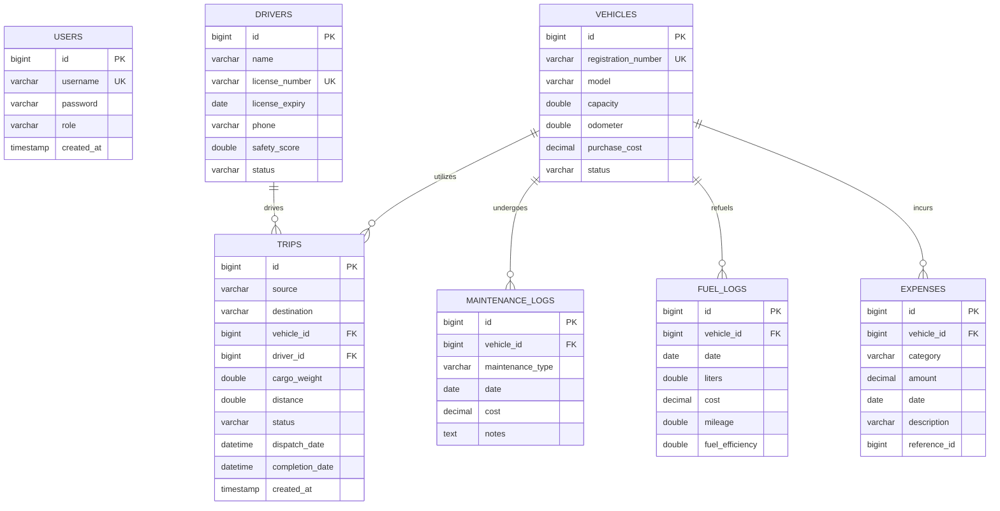

# TransitOps Database Design

This document describes the schema design for the **TransitOps - Smart Transport Operations Platform** database. The database is modeled for MySQL and managed via Hibernate ORM.

## Relational Schema Diagram (Mermaid)

## Tables & Fields Description

### 1. `users`
Stores application user accounts and roles for Role Based Access Control (RBAC).
- `id`: BIGINT, Auto Increment, Primary Key.
- `username`: VARCHAR(50), Unique, Not Null. The username used for login.
- `password`: VARCHAR(255), Not Null. BCrypt hashed password.
- `role`: VARCHAR(50), Not Null. Roles: `FLEET_MANAGER`, `DISPATCHER`, `SAFETY_OFFICER`, `FINANCIAL_ANALYST`.
- `created_at`: TIMESTAMP, Defaults to current time.

### 2. `vehicles`
Stores fleet vehicle info.
- `id`: BIGINT, Auto Increment, Primary Key.
- `registration_number`: VARCHAR(20), Unique, Not Null. License plate number of the vehicle.
- `model`: VARCHAR(100), Not Null.
- `capacity`: DOUBLE, Not Null. Cargo weight limit in kilograms (kg).
- `odometer`: DOUBLE, Not Null. Current mileage reading.
- `purchase_cost`: DECIMAL(12,2), Not Null. Initial cost of vehicle.
- `status`: VARCHAR(20), Not Null. Default: `'ACTIVE'`. Values: `ACTIVE`, `IN_SHOP`, `OUT_OF_SERVICE`.

### 3. `drivers`
Stores operator driver info.
- `id`: BIGINT, Auto Increment, Primary Key.
- `name`: VARCHAR(100), Not Null.
- `license_number`: VARCHAR(50), Unique, Not Null.
- `license_expiry`: DATE, Not Null. Used to check for expired licenses.
- `phone`: VARCHAR(20), Not Null.
- `safety_score`: DOUBLE, Default `100.0`. Score out of 100 based on safety reviews.
- `status`: VARCHAR(20), Not Null. Default: `'AVAILABLE'`. Values: `AVAILABLE`, `ON_TRIP`, `INACTIVE`.

### 4. `trips`
Tracks shipping assignments.
- `id`: BIGINT, Auto Increment, Primary Key.
- `source`: VARCHAR(255), Not Null.
- `destination`: VARCHAR(255), Not Null.
- `vehicle_id`: BIGINT, Foreign Key referencing `vehicles(id)`.
- `driver_id`: BIGINT, Foreign Key referencing `drivers(id)`.
- `cargo_weight`: DOUBLE, Not Null. Cargo weight of the trip. Must not exceed vehicle capacity.
- `distance`: DOUBLE, Not Null. Total trip distance in kilometers (km).
- `status`: VARCHAR(20), Not Null. Default: `'DRAFT'`. Values: `DRAFT`, `DISPATCHED`, `COMPLETED`, `CANCELLED`.
- `dispatch_date`: DATETIME. Recorded when trip is dispatched.
- `completion_date`: DATETIME. Recorded when trip is completed.
- `created_at`: TIMESTAMP, Defaults to current time.

### 5. `maintenance_logs`
Logs repair operations.
- `id`: BIGINT, Auto Increment, Primary Key.
- `vehicle_id`: BIGINT, Foreign Key referencing `vehicles(id)`.
- `maintenance_type`: VARCHAR(100), Not Null. Type of service (e.g. `Routine`, `Repair`, `Inspection`).
- `date`: DATE, Not Null. Date of service.
- `cost`: DECIMAL(12,2), Not Null. Cost of maintenance.
- `notes`: TEXT. Additional service comments.

### 6. `fuel_logs`
Logs refueling instances.
- `id`: BIGINT, Auto Increment, Primary Key.
- `vehicle_id`: BIGINT, Foreign Key referencing `vehicles(id)`.
- `date`: DATE, Not Null.
- `liters`: DOUBLE, Not Null. Total liters pumped.
- `cost`: DECIMAL(12,2), Not Null. Cost of fueling.
- `mileage`: DOUBLE, Not Null. Odometer reading at refueling. Used to calculate mileage differences.
- `fuel_efficiency`: DOUBLE, Not Null. Calculated as `(current_mileage - previous_mileage) / liters`.

### 7. `expenses`
Consolidated operational expenses.
- `id`: BIGINT, Auto Increment, Primary Key.
- `vehicle_id`: BIGINT, Foreign Key referencing `vehicles(id)`, Nullable.
- `category`: VARCHAR(50), Not Null. Categories: `MAINTENANCE`, `FUEL`, `OTHER`.
- `amount`: DECIMAL(12,2), Not Null. Expense cost.
- `date`: DATE, Not Null.
- `description`: VARCHAR(255).
- `reference_id`: BIGINT, Nullable. Links back to `maintenance_logs(id)` or `fuel_logs(id)` to avoid double-counting but allow audit trail.

---

## Business Rules Mapping to DB Constraints

1. **Unique Vehicle Registration Number**: Enforced by UNIQUE constraint on `vehicles(registration_number)`.
2. **Unique Driver License**: Enforced by UNIQUE constraint on `drivers(license_number)`.
3. **Capacity Constraints**: Checked programmatically in business logic during trip dispatching, comparing `trips.cargo_weight` with `vehicles.capacity`.
4. **Driver Eligibility**: Programmatic check: a driver with `license_expiry < CURRENT_DATE` or status != `'AVAILABLE'` cannot be dispatched.
5. **Vehicle Availability**: A vehicle with status = `'IN_SHOP'` or status = `'OUT_OF_SERVICE'` cannot be assigned to a new trip.
